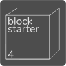

# blockstarter 4.0
  
Kickstarter-inspired platform which stores progress and fundings on Blockchain

Created as project in the course **Advanced Enterprise Computing SS2017** at TU Berlin

## Functionality and Extension
|`TODO decide for extension at second update meeting 30.06. and try to list requirements`
|-----

## Development
### Project Structure and Technologies
* Blockchain using `testrpc`
* WebUI and Backend: Express (using Handlebars as Templating-Engine)
* Documentation: markdown (this very file)
* Report: LaTeX
* Presentation: Google presentation

### Get Started
|Do not forget to run `npm i` before you `npm start`

Run the TestRPC from the blockchain folder (after `npm install`)
```
cd blockchain
npm start
```
A script will be started which does the following steps:

* Compile the contracts
* Initialize testrpc
* Create the `global` blockstarter contract, our `database`
* Create two dummy test projects for testing purposes
* Create a json file named `blockstarterData.json` which contains all necessary information for express to start (like abis and the global contract address)

After that the express server can be started and connected to the blockchain
```
cd express
npm start
```

### Team
This project is implemented by **group D**, which consists of the following team members:

| Name | github | mail
|------|--------|----
|Nikhil Singh|nikkytub|<nikhil.singh@campus.tu-berlin.de>
|Thomas Wirth|wtho|<t.wirth@campus.tu-berlin.de>
|Dukagjin Ramosaj|dukagjinramosaj1|<dukagjin.ramosaj@campus.tu-berlin.de>
|Zeba Bushra Khalil|zebakhalil|<z.khalil@campus.tu-berlin.de>
|Niklas Zbozinek | Zbozi | <niklas.zbozinek@campus.tu-berlin.de>
|Raviprasad M R | raviprasadmr | <r.marikeramesha@campus.tu-berlin.de>
|Ankita Shah Ashwin| ankita-1301 | <ankita.s.ashwin@campus.tu-berlin.de>
|Darshan Hingu| darshan0071990/darshanhorizzon | <hingudarshan@win.tu-berlin.de>

### Milestones
1. First Update Meeting 23.06.
1. Second Update Meeting 30.06. - **Deadline Blockstarter v4**
1. Third Update Meeting 07.06. - **Deadline Extension**
1. Final Submission 13.06. (end of day) **Deadline Report**
1. Presentation 14.06. (12:00 - 14:00, 10 minutes)

### Grading
* Source Code and Documentation [8]
* ~ 15 Pages PDF Report [8]
* Participation in Update Meetings and Presentation [4]  
*As the supervisors mentioned in the kick-off everyone should be an active part of the group and participate in discussions during the update meetings. These meetings on Fridays are mandatory.*

